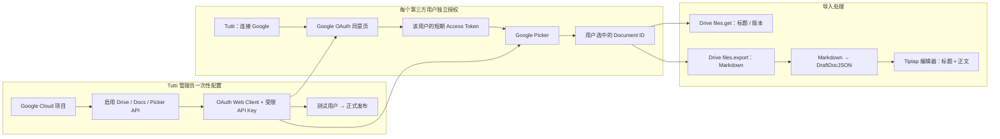

# Google Docs Picker 个人授权与导入指南

## 方案结论

当前 Demo 使用 Google Picker + `drive.file`：用户用个人 Google 账号授权，在 Google 官方弹窗中选择一篇 Docs，Tutti 只获得该文档的访问权并导入正文。

## 完整流程图



Tutti 只维护一套应用身份（OAuth Client ID、受限 API Key 和 Project Number）。第三方用户不需要创建自己的 Google Cloud 项目；每个人用自己的 Google 账号授权，并获得彼此隔离、约 1 小时有效的 access token。

```text
Google Identity Services token model
  → scope: drive.file
  → Google Picker 展示个人 Drive
  → 用户选择一篇 Google Docs
  → 短期 access token + 选中文档 ID 交给 Tutti 服务端会话
  → Drive API files.get 读取标题与版本
  → Drive API files.export(text/markdown) 导出正文
  → Markdown parser
  → CanonicalDocument
  → Tutti DraftDocJSON
```

`drive.file` 是 Google 推荐的 non-sensitive、per-file Scope。它可以读取并导出 Picker 授权的单篇文件，不需要 `documents.readonly`、`drive.metadata.readonly` 或 `drive.readonly`。Tutti 无法读取用户完整 Drive 列表，只能读取用户通过 Picker 授权给当前应用的文件。

## Google Cloud 配置

1. 创建或选择 Google Cloud Project。
2. 启用以下 API：
   - Google Picker API
   - Google Drive API
   - Google Docs API
3. 在 Google Auth Platform 配置 Branding、Audience 和 Data Access。
4. Data Access 只添加：

   ```text
   https://www.googleapis.com/auth/drive.file
   ```

5. 开发阶段把个人 Google 账号加入 Test users。
6. 创建 **Web application** OAuth Client，并添加 Authorized JavaScript origin：

   ```text
   http://localhost:3000
   http://127.0.0.1:3000
   ```

   Picker token model 不需要 Authorized redirect URI，也不需要在应用里使用 Client Secret。

7. 创建 API Key：
   - Application restrictions 选择 **Websites**。
   - Website restriction 添加 `http://localhost:3000/*` 和 `http://127.0.0.1:3000/*`；生产环境添加正式 HTTPS 域名。
   - API restrictions 至少限制到 **Google Picker API**。
8. 在 Cloud Project 信息页复制数字格式的 Project Number，作为 Picker App ID。
9. 在不会提交到 Git 的 `apps/demo-next/google-picker.config.local.json` 配置：

   ```json
   {
     "clientId": "xxx.apps.googleusercontent.com",
     "apiKey": "AIza...",
     "projectNumber": "123456789012"
   }
   ```

   当前本地 Demo 已使用这种 JSON 配置，不要求设置环境变量。生产部署时仍可用部署平台的 Secret / Variable 覆盖本地文件值。

10. 启动 `npm run dev`，打开 `http://localhost:3000/import-demo`，选择 Google Docs，点击“使用 Google Picker 选择文档”。

## 实现链路

```text
GET /api/connectors/google-docs/authorize
  → 只返回公开 Picker 配置：Client ID、受限 API Key、Project Number、Scope

Browser
  → 加载 https://accounts.google.com/gsi/client
  → initTokenClient(scope: drive.file)
  → 加载 https://apis.google.com/js/api.js 的 picker library
  → PickerBuilder + DocsView(DOCUMENTS, LIST)
  → 用户选择文档

POST /api/connectors/google-docs/authorize
  → 校验选中文档 URL/ID
  → access token 只写入服务端内存会话
  → 浏览器保存随机 HttpOnly Session Cookie

POST /api/content-import/preview
  → 强制 source ID 等于本次 Picker 选中的文档 ID
  → Drive API files.get 读取标题、版本与修改时间
  → Drive API files.export?mimeType=text/markdown
  → Markdown 转 CanonicalDocument
  → CanonicalDocument 转 DraftDocJSON / Tiptap
  → Markdown 导出异常时回退 Docs API documents.get?includeTabsContent=true
```

## 授权与安全边界

- 个人 Google 账号即可授权，不要求 Google Workspace 管理员或服务账号。
- Google access token 必须传给 Picker，因此会短暂存在于当前页面内存。默认不会写入 Local Storage、URL 或日志；设置 `BROWSER_SESSION_PERSISTENCE=true` 后可显示默认关闭的实验开关，用户手动开启时会写入当前浏览器 Local Storage。
- 选中后 access token 通过同源 HTTPS POST 交给 Tutti 服务端，浏览器随后只使用 HttpOnly Session Cookie。
- GIS token model 不返回 refresh token。即使开启实验持久化，当前 Token 最长约 1 小时，过期后用户仍需重新打开 Picker。
- 服务端仅允许导入当前 Picker 回调返回的文档 ID，不能靠修改文本框扩大访问范围。
- API Key 会出现在客户端代码中，这是 Picker 的正常用法；必须使用 HTTP referrer 和 API restriction 限制滥用。
- 生产环境仍需隐私政策、域名/品牌配置，并遵守 Google API Services User Data Policy；但 `drive.file` 避免了 restricted Drive Scope 的安全评估路径。

## 当前转换范围

- 标题使用 Drive `files.get` 返回的文件名，不依赖正文第一行。
- 正文优先使用 Google 官方 `text/markdown` 导出，统一解析普通段落、标题、粗体、斜体、删除线、链接、等宽文本、列表、表格、分割线和图片引用。
- Markdown 导出为空时返回 `partial_document` warning。
- Markdown 导出接口异常时回退原有 Docs API 结构化解析，继续支持多 Tab、表格、列表和内嵌图片。
- 外部图片仍通过素材清单交给宿主转存，不能把临时地址当作永久 Tutti 素材地址。

## 官方资料

- [Integrate Google Picker into web apps](https://developers.google.com/workspace/drive/picker/guides/web-picker)
- [Google Picker overview](https://developers.google.com/workspace/drive/picker/guides/overview)
- [Choose Google Drive API scopes](https://developers.google.com/workspace/drive/api/guides/api-specific-auth)
- [Export Google Workspace documents](https://developers.google.com/workspace/drive/api/guides/manage-downloads)
- [Google Workspace export MIME types](https://developers.google.com/workspace/drive/api/guides/ref-export-formats)
- [Docs documents.get](https://developers.google.com/workspace/docs/api/reference/rest/v1/documents/get)
