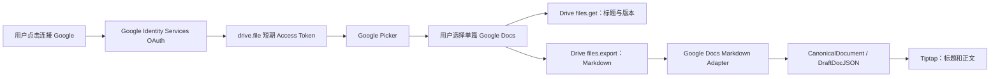

# Tutti Google Docs Picker 生产配置

本文记录 Tutti Google Docs 导入在 Google Cloud、Vercel 和正式域名上的实际配置。用于后续维护、域名迁移和故障排查。

> 安全约定：OAuth Client ID、Google Cloud Project ID 和 Project Number 都是公开标识，可以写入文档。Picker API Key 虽然会下发到浏览器，但仍不在 Git 中记录明文，必须通过 HTTP Referrer 和 API 限制控制使用范围。

## 1. 当前生产环境

| 项目 | 当前值 |
| --- | --- |
| 正式站点 | `https://tutti.aikee.xyz` |
| Google Docs 导入页 | `https://tutti.aikee.xyz/import-demo` |
| 隐私政策 | `https://tutti.aikee.xyz/privacy` |
| 服务条款 | `https://tutti.aikee.xyz/terms` |
| Vercel Project | `tutti` |
| GitHub Repository | `Malenconiaprincep/AI-Draft-Review` |
| Vercel Root Directory | `apps/demo-next` |

## 2. Google Cloud 项目信息

| 项目 | 当前值 |
| --- | --- |
| Project Name | `Tutti Google Docs Import` |
| Project ID | `ornate-opus-502403-p8` |
| Project Number / Picker App ID | `738504780857` |
| OAuth App Name | `Tutti Google Docs Import` |
| OAuth Client Name | `Tutti Local Web` |
| OAuth Client Type | Web application |
| OAuth Client ID | `738504780857-fpsvig7v5l00o3pn7bdsnsskhdlsra3d.apps.googleusercontent.com` |
| Support / Developer Email | `makuta0919@gmail.com` |

## 3. 必须启用的 Google API

在 Google Cloud Console 的 **APIs & Services → Enabled APIs & services** 中启用：

- Google Drive API
- Google Docs API
- Google Picker API

## 4. Google Auth Platform 配置

### Branding

| 字段 | 当前值 |
| --- | --- |
| 应用名称 | `Tutti Google Docs Import` |
| 用户支持邮箱 | `makuta0919@gmail.com` |
| 应用首页 | `https://tutti.aikee.xyz/` |
| 隐私权政策 | `https://tutti.aikee.xyz/privacy` |
| 服务条款 | `https://tutti.aikee.xyz/terms` |
| 已获授权的网域 | `aikee.xyz` |
| 开发者联系邮箱 | `makuta0919@gmail.com` |

当前 `aikee.xyz` 已通过 Google Search Console 的 DNS 所有权验证。验证 TXT 由 Google Domain Connect 通过 Cloudflare 添加，不要删除该 TXT，否则可能丢失域名所有权验证状态。

### Audience

- User type：**External**
- Publishing status：**In production / 正式版**
- 测试阶段使用过的 Test user：`makuta0919@gmail.com`
- 正式版允许任意 Google 账号发起授权，不再依赖 Test users 列表。

### Data Access

只申请以下 Scope：

```text
https://www.googleapis.com/auth/drive.file
```

不要增加以下全盘读取 Scope，除非产品需求和安全审核路径发生变化：

```text
https://www.googleapis.com/auth/drive.readonly
https://www.googleapis.com/auth/drive.metadata.readonly
https://www.googleapis.com/auth/documents.readonly
```

`drive.file` 是 non-sensitive、per-file Scope。用户必须通过 Google Picker 主动选择文档，Tutti 不能遍历用户完整 Drive。

### Verification

- Data access：因为只使用 `drive.file`，当前无需敏感或受限 Scope 验证。
- Branding：已提交 Google 品牌验证，当前状态为审核中。
- 品牌审核通过前，部分首次授权用户仍可能看到“应用未经 Google 验证”的提示；正式发布状态和 OAuth 功能不受影响。

## 5. OAuth Web Client 配置

### Authorized JavaScript origins

当前允许以下来源：

```text
http://localhost:3000
http://127.0.0.1:3000
https://aikee.xyz
https://tutti.aikee.xyz
```

生产应用实际使用：

```text
https://tutti.aikee.xyz
```

Origin 必须精确匹配协议、域名和端口。这里不能带路径或尾部 `/`。

### Authorized redirect URIs

当前流程使用 Google Identity Services token model：

```text
不需要配置 Redirect URI
不需要 OAuth Client Secret
```

GIS 在浏览器弹窗中返回短期 access token，`redirect_uri=gis_transform` 由 Google SDK 内部处理。

## 6. Google Picker API Key

API Key 名称：

```text
Tutti Local Picker
```

Application restrictions：**Websites / HTTP referrers**

生产 Referrer：

```text
https://tutti.aikee.xyz/*
```

本地开发如需使用，可同时保留：

```text
http://localhost:3000/*
http://127.0.0.1:3000/*
```

API restrictions：至少限制为：

```text
Google Picker API
```

API Key 明文存放位置：

- 本地：`apps/demo-next/google-picker.config.local.json`，已加入 `.gitignore`。
- 生产：Vercel Project `tutti` 的 Environment Variables。
- 不要把 API Key 写入本 Markdown、README、Issue 或 Git 提交。

## 7. 应用配置映射

Vercel Project `tutti` 当前配置以下变量，作用于 Production 和 Preview：

```text
GOOGLE_CLIENT_ID
GOOGLE_PICKER_API_KEY
GOOGLE_CLOUD_PROJECT_NUMBER
```

对应关系：

| 应用变量 | Google 配置 |
| --- | --- |
| `GOOGLE_CLIENT_ID` | OAuth Web Client ID |
| `GOOGLE_PICKER_API_KEY` | 受 Referrer 和 Picker API 限制的 API Key |
| `GOOGLE_CLOUD_PROJECT_NUMBER` | Project Number，也就是 Picker `appId` |

本地不要求使用 `.env`。默认读取：

```text
apps/demo-next/google-picker.config.local.json
```

格式：

```json
{
  "clientId": "xxx.apps.googleusercontent.com",
  "apiKey": "AIza...",
  "projectNumber": "123456789012"
}
```

服务端环境变量仅作为生产部署覆盖，不会要求最终用户填写任何配置。

## 8. Cloudflare 与域名

Cloudflare DNS 当前记录：

| Type | Name | Target | Proxy |
| --- | --- | --- | --- |
| CNAME | `tutti` | `169e4524ef422757.vercel-dns-017.com` | DNS only |

Vercel 要求关闭 Cloudflare Proxy，当前状态为 **DNS only**。Vercel 项目域名状态已显示 **Valid Configuration / Production**。

## 9. 用户授权与导入链路



安全边界：

- 浏览器不会把 token 写入 URL 或 Local Storage。
- access token 通过同源 HTTPS POST 交给服务端短期内存会话。
- 浏览器后续只保留随机 HttpOnly Session Cookie。
- GIS token model 不返回 refresh token，access token 最长约 1 小时。
- 服务端只允许导入本次 Picker 选择的 Document ID。

## 10. 生产验收清单

- [x] `https://tutti.aikee.xyz` HTTPS 可访问。
- [x] Vercel Domain 为 Valid Configuration。
- [x] `/privacy` 和 `/terms` 对公网开放。
- [x] OAuth JavaScript origin 包含 `https://tutti.aikee.xyz`。
- [x] Picker API Key Referrer 包含 `https://tutti.aikee.xyz/*`。
- [x] Search Console 已验证 `aikee.xyz`。
- [x] OAuth Audience 已切换到正式版。
- [x] 生产 OAuth 弹窗可以进入 Google 账号选择页，没有 `origin_mismatch`。
- [x] Scope 只有 `drive.file`。
- [ ] Google Branding 审核通过。

## 11. 常见故障

### `Error 400: origin_mismatch`

检查 OAuth Client 的 Authorized JavaScript origins 是否包含浏览器地址的精确 Origin：

```text
https://tutti.aikee.xyz
```

不要写成：

```text
https://tutti.aikee.xyz/
https://tutti.aikee.xyz/import-demo
http://tutti.aikee.xyz
```

### `popup_failed_to_open`

- 必须在用户点击事件中同步调用 GIS `requestAccessToken()`。
- 页面初始化时预加载 GIS 和 Picker SDK。
- 检查浏览器是否阻止当前站点弹窗。

### Picker 打开但 API Key 被拒绝

- 检查 HTTP Referrer 是否为 `https://tutti.aikee.xyz/*`。
- 检查 API Key 是否允许 Google Picker API。
- 等待 Google Cloud 配置传播，通常需要几分钟，极端情况下可能更久。

### 显示“应用未经 Google 验证”

- 确认 Audience 已是正式版。
- 确认首页、隐私政策和服务条款均为公开 HTTPS 页面。
- 确认 `aikee.xyz` 已完成 Search Console 所有权验证。
- 在 Branding 页面提交品牌验证，并等待 Google 审核完成。

## 12. 更换正式域名

以后从 `tutti.aikee.xyz` 换到新域名时，需要同步完成：

1. 在部署平台绑定新域名并确认 HTTPS。
2. 在 DNS 提供商添加部署平台要求的记录。
3. 在 OAuth Client 添加新域名的精确 JavaScript Origin。
4. 在 Picker API Key 添加 `https://新域名/*` Referrer。
5. 在 Branding 更新首页、隐私政策和服务条款 URL。
6. 如果顶级私有域发生变化，在 Authorized domains 添加新顶级域名。
7. 在 Search Console 验证新顶级域名。
8. 重新提交 Google 品牌验证。
9. 新域名审核和生产验证完成后，再删除旧 Origin 与旧 Referrer。

